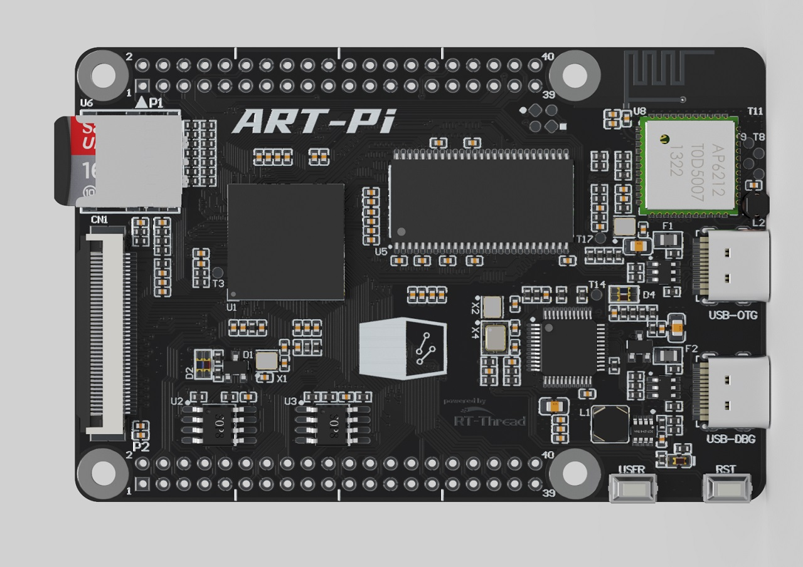

# ART-PI RT-Thread

## 简介

该仓库是对 ART-Pi 开发板的 WiFi 开源驱动支持包，也可作为物联网开发使用的软件SDK，可以更简单方便的开发物联网程序。

STM32H750 是 RT-Thread 推出的一款基于 ARM Cortex-M7 内核的开发板，最高主频为 480Mhz，该开发板具有丰富的板载资源，可以充分发挥 STM32H750 的芯片性能。

## 开发板介绍

ART-Pi 是 RT-Thread 团队经过半年的精心准备，专门为嵌入式软件工程师、开源创客设计的一款极具扩展功能的 DIY 开源硬件。

如果您想了解更多关于 **ART-Pi** 最新的开源扩展硬件及技术分享文章，请访问 [ART-Pi主页](https://art-pi.gitee.io/website/)。



该开发板常用 **板载资源** 如下：

- STM32H750XBH6
- On-board ST-LINK/V2.1
- USB OTG with Type-C connector
- SDIO TF Card slot
- SDIO WIFI:AP6212
- HDC UART BuleTooth:AP6212
- RGB888 FPC connector
- 32-Mbytes SDRAM
- 16-Mbytes SPI FLASH
- 8-Mbytes QSPI FLASH
- D1(blue) for 3.3 v power-on
- Two user LEDs:D2 (blue),D2 (red)
- Two ST-LINK LEDs: D4(blue),D4 (red)
- Two push-buttons (user and reset)

开发板更多详细信息请参考 [ART-PI](https://art-pi.gitee.io/website)

官方仓库 [sdk-bsp-stm32h750-realthread-artpi](https://github.com/RT-Thread-Studio/sdk-bsp-stm32h750-realthread-artpi)

### 快速上手

本 BSP 为开发者提供 MDK5 和 IAR 工程，并且支持 GCC 开发环境。下面以 MDK5 开发环境为例，介绍如何将系统运行起来。

#### 硬件连接

使用数据线连接开发板到 PC，将 TVCC 接到 3.3V。使用 usb 转串口工具连接 TTLRX 和 TTLTX。

#### 编译下载

双击 project.uvprojx 文件，打开 MDK5 工程，编译并下载程序到开发板。

> 工程默认配置使用 ST_LINK 仿真器下载程序，在通过 ST_LINK 连接开发板的基础上，点击下载按钮即可下载程序到开发板

#### 运行结果

下载程序成功之后，系统会自动运行，LED闪烁。

连接开发板对应串口到 PC , 在终端工具里打开相应的串口（115200-8-1-N），复位设备后，可以看到 RT-Thread 的输出信息:

```bash
 \ | /
- RT -     Thread Operating System
 / | \     5.0.0 build Mar 13 2024 18:17:18
 2006 - 2022 Copyright by RT-Thread team
lwIP-2.0.3 initialized!
[I/SFUD] Found a Winbond flash chip. Size is 16777216 bytes.
[I/SFUD] norflash0 flash device initialized successfully.
[I/SFUD] Probe SPI flash norflash0 by SPI device spi10 success.
[D/FAL] (fal_flash_init:47) Flash device |                norflash0 | addr: 0x00000000 | len: 0x01000000 | blk_size: 0x00001000 |initialized finish.
[I/FAL] ==================== FAL partition table ====================
[I/FAL] | name         | flash_dev |   offset   |    length  |
[I/FAL] -------------------------------------------------------------
[I/FAL] | whd_firmware | norflash0 | 0x00000000 | 0x00070000 |
[I/FAL] | whd_clm      | norflash0 | 0x00070000 | 0x00008000 |
[I/FAL] | bt_image     | norflash0 | 0x00080000 | 0x00080000 |
[I/FAL] | download     | norflash0 | 0x00100000 | 0x00200000 |
[I/FAL] | easyflash    | norflash0 | 0x00300000 | 0x00100000 |
[I/FAL] | filesystem   | norflash0 | 0x00400000 | 0x00c00000 |
[I/FAL] =============================================================
[I/FAL] RT-Thread Flash Abstraction Layer initialize success.
[Flash] (..\offline-packages\easyflash\src\ef_env.c:1818) ENV start address is 0x00000000, size is 8192 bytes.
[Flash] EasyFlash V4.1.0 is initialize success.
[Flash] You can get the latest version on https://github.com/armink/EasyFlash .
[I/sal.skt] Socket Abstraction Layer initialize success.
WLAN MAC Address : 2C:B0:FD:A2:2E:26
WLAN Firmware    : wl0: Mar 28 2021 22:55:55 version 7.45.98.117 (dc5d9c4 CY) FWID 01-d36e8386
WLAN CLM         : API: 12.2 Data: 9.10.39 Compiler: 1.29.4 ClmImport: 1.36.3 Creation: 2021-03-28 22:47:33
WHD VERSION      : 3.0.0.22316 : v3.0.0 : ARM CLANG 5060960 : 2023-12-04 07:24:34 -0600
[I/WLAN.dev] wlan init success
[I/WLAN.lwip] eth device init ok name:w0
[I/WLAN.dev] wlan init success
[I/WLAN.lwip] eth device init ok name:w1
[I/FAL] The FAL block device (filesystem) created successfully
msh />
```
### 进阶使用

1. 在 bsp 下打开 env 工具。

2. 输入`menuconfig`命令配置工程，配置好之后保存退出。

3. 输入`pkgs --update`命令下载在线软件包。

4. 将下载的软件包移动到 `offlin-package` 目录中，并删除软件包内的 `.git` 文件夹。

4. 输入`scons --target=vsc/mdk5` 命令重新生成工程。

## 注意事项

- 调试串口为串口4 映射说明

    PI9  ------> USART4_RX

    PA0 ------> USART4_TX 

- Bootloader 损坏 或 缺失

    如遇到程序下载后，板子跑不起来的情况，请先通过串口查看复位后bootloader打印信息 “ART-PiBOOT” ，以检查bootloader是否损坏或丢失。若 bootloader 缺失，则需要重新烧写目录下 artpi_bootloader.bin 文件到芯片内部flash；在连接开发板至 PC 后，ART-Pi 会显示为存储设备，直接将 artpi_bootloader.bin 拖入文件管理器中 ART-Pi 目录下即可（类似复制文件）。

    此 bin 文件由 [ART-Pi sdk](https://github.com/RT-Thread-Studio/sdk-bsp-stm32h750-realthread-artpi) 下 art_pi_bootloader 示例工程构建生成，生成过程参考 [ART-Pi 开发手册](https://github.com/RT-Thread-Studio/sdk-bsp-stm32h750-realthread-artpi/blob/master/documents/UM5002-RT-Thread%20ART-Pi%20%E5%BC%80%E5%8F%91%E6%89%8B%E5%86%8C.md) ；工程构建后，bin 文件生成在工程目录 Debug 路径下。
    
- 外部 flash 下载算法

    参考 [ART-Pi 常见问题说明文档](https://github.com/RT-Thread-Studio/sdk-bsp-stm32h750-realthread-artpi/blob/master/documents/UM5005-RT-Thread%20ART-Pi%20%E5%B8%B8%E8%A7%81%E9%97%AE%E9%A2%98%E8%A7%A3%E7%AD%94.md) ，解决MDK5无法下载程序的问题。

